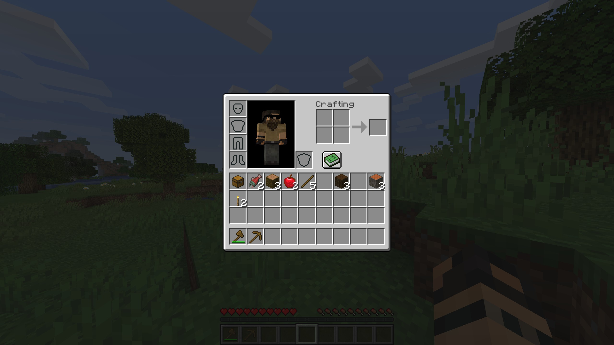

.. _environments:

.. role:: python(code)
   :language: python

General Information
================================

The :code:`minerl` package includes several environments as follows.
This page describes each of the included environments, provides usage samples,
and describes the exact action and observation space provided by each
environment!

.. note::
    All environments offer a default no-op action via :code:`env.action_space.no_op()`
    and a random action via :code:`env.action_space.sample()`.

Observation Space
------------------

Most environments use the same observation space (just an RGB image):

.. code-block:: python

    Dict(pov:Box(low=0, high=255, shape=(360, 640, 3)))

Action Space
------------------

Most environments use the same action space, which is a dictionary containing a 
multitude of different actions. Note that :code:`Discrete` and :code:`Box` are 
actions spaces defined by Gym.

.. exec::
    from minerl.herobraine.env_specs.basalt_specs import FindCaveEnvSpec
    from minerl.utils.documentation import _format_dict 

    print(_format_dict(FindCaveEnvSpec().action_space))
    

Here is an example action:

.. code-block:: python

    {"ESC":1, "camera":[10, 45], "swapHands":1}

:code:`ESC`
************************

The :code:`ESC` action is used to end the episode.

:code:`inventory`
************************
The :code:`inventory` opens the inventory GUI. This will yield an observation
image something like the following:

:code:`camera`
************************
This action changes the orientation of the agent’s head by the corresponding number 
of degrees. The head changes its orientation 
pitch by the first component and its yaw by the second component. 
Both components are limited to [-180, 180] inclusive.

