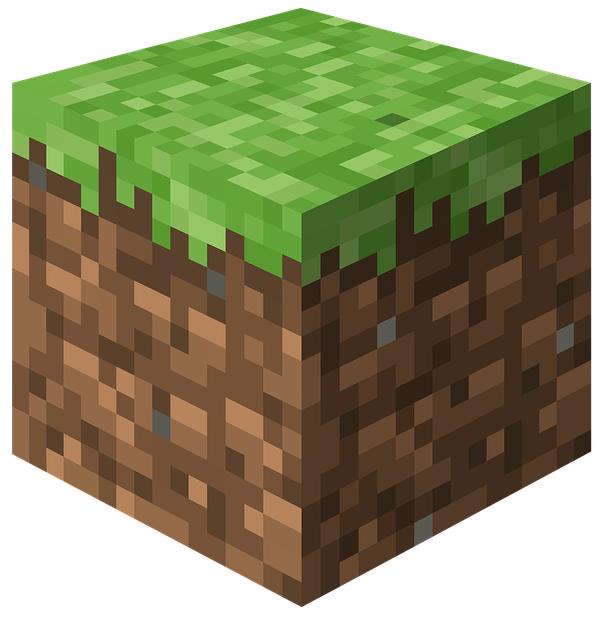
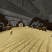
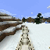
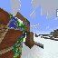
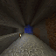
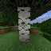
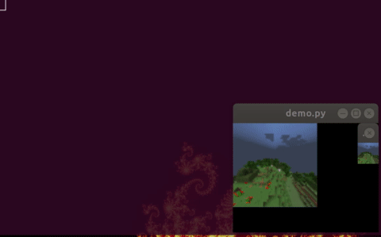

.. role:: raw-html(raw)
    :format: html

==================================
MineRL: Towards AI in Minecraft
==================================

.. image:: assets/survival1.mp4.gif
  :scale: 100 %
  :alt:

.. |biohazard| image:: https://pepy.tech/badge/minerl

|biohazard| :raw-html:`  `
Welcome to documentation for the MineRL_
project and its related repositories and components!

.. _MineRL: http://minerl.io
.. _OpenAI Gym: https://gym.openai.com
.. _MineRL-v0 Dataset: http://minerl.io/dataset
.. _set of environments: http://minerl.io/docs/environments

What is MineRL
---------------

MineRL is a research project started at Carnegie Mellon University aimed at
developing various aspects of artificial intelligence
within Minecraft. In short MineRL consists of several major
components:

- `MineRL-v0 Dataset`_ -- One of the largest imitation learning
  datasets with over **60 million frames** of recorded human player
  data. The dataset includes a `set of environments`_ which highlight
  many of the hardest problems in modern-day Reinforcement
  Learning: sparse rewards and hierarchical policies.

- :code:`minerl` -- A rich python3 package for doing artificial intelligence
  research in Minecraft. This includes two major submodules. We develop :code:`minerl` in our spare time, `please consider supporting us on Patreon`_

  - :code:`minerl.env` -- A growing set of OpenAI Gym environments
    in Minecraft. These environments leverage a **synchronous**, **stable**,
    and **fast** fork of Microsoft Malmo called *MineRLEnv*.
  - :code:`minerl.data` -- The main python module for ext with the *MineRL-v0* dataset

.. _please consider supporting us on Patreon: https://www.patreon.com/wguss_imushroom

.. toctree::
   :caption: Tutorials and Guides
   :maxdepth: 2

   tutorials/index
   tutorials/first_agent
   tutorials/data_sampling
   tutorials/more_examples
   tutorials/k-means
   tutorials/minerl_tools
   tutorials/custom_environments
   tutorials/minecraft_commands

.. toctree::
   :caption: MineRL Environments
   :maxdepth: 2

   environments/index

.. toctree::
   :caption: Notes
   :maxdepth: 2

   notes/performance-tips
   notes/useful-links
   notes/windows

.. toctree::
    :maxdepth: 2
    :caption: MineRL package API Reference

    api/env
    api/data
    api/herobraine

Indices and tables
---------------------

* :ref:`genindex`
* :ref:`modindex`
* :ref:`search`
