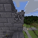

.. role:: raw-html(raw)
    :format: html

.. image:: assets/block.png
   :scale: 4 %
   :alt: alternate text
   :align: left

==================================
MineRL: Towards AI in Minecraft
==================================

.. image:: assets/survival2.mp4.gif
  :scale: 100 %
  :alt:

.. image:: assets/survival4.mp4.gif
  :scale: 100 %
  :alt:

.. |biohazard| image:: https://pepy.tech/badge/minerl

|biohazard| :raw-html:`  `
Welcome to documentation for the MineRL_
project and its related repositories and components!

.. _MineRL: http://minerl.io
.. _OpenAI Gym: https://gym.openai.com
.. _set of environments: http://minerl.io/docs/environments

What is MineRL
---------------

MineRL is a rich Python 3 library which provides a `OpenAI Gym`_ interface for interacting 
with the video game Minecraft, accompanied with datasets of human gameplay.

Started as a research project at Carnegie Mellon University, MineRL aims to assist
in the develpment of various aspects of artificial intelligence within Minecraft.

.. toctree::
   :caption: Tutorials and Guides
   :maxdepth: 2

   tutorials/index
   tutorials/first_agent
   tutorials/more_tutorials

.. toctree::
   :caption: MineRL Environments
   :maxdepth: 2

   environments/index
   environments/basalt
   environments/diamond
   

.. toctree::
   :caption: Notes
   :maxdepth: 2

   notes/performance-tips
   notes/useful-links
   notes/faq
   notes/windows
   notes/versions
   notes/interfaces

Indices and tables
---------------------

* :ref:`genindex`
* :ref:`modindex`
* :ref:`search`
