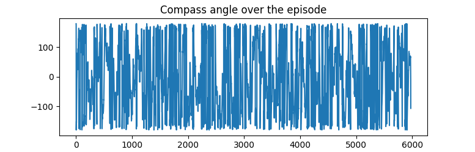
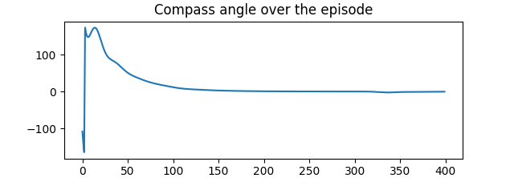
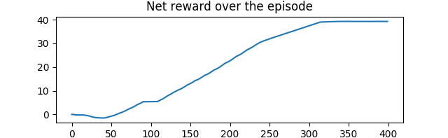

===============================
Hello World: Your First Agent
===============================

With the :code:`minerl` package installed on your system you can
now make your first agent in Minecraft!

To get started, let's first import the necessary packages

.. code-block:: python

    import gym
    import minerl

Creating an environment
---------------------------

.. _checkout the environment documentation: http://minerl.io/docs/environments/
.. _many environments: http://minerl.io/docs/environments/

Now we can choose any one of the `many environments`_ included
in the :code:`minerl` package. To learn more about the environments
`checkout the environment documentation`_.

For this tutorial we'll  choose the :code:`MineRLNavigateDense-v0`
environment. In this task, the agent is challenged with using
a first-person perspective of a random Minecraft map and
navigating to a target.

To create the environment, simply invoke :code:`gym.make`

.. code-block:: python

    env = gym.make('MineRLNavigateDense-v0')

.. caution:: 
    Currently :code:`minerl` only supports environment rendering in **headed environments**
    (servers with monitors attached). 

    **In order to run** :code:`minerl` **environments without a head use a software renderer
    such as** :code:`xvfb`::

        xvfb-run python3 <your_script.py>
    
    
    Alternatively, you can use an environment variable which automatically adds xvfb when
    launching MineRL::
        
        MINERL_HEADLESS=1 python3 <your_script.py>

.. note::
    If you're worried and want to make sure something is
    happening behind the scenes install a logger **before**
    you create the envrionment.
    
    .. code-block:: python

        import logging
        logging.basicConfig(level=logging.DEBUG)
        
        env = gym.make('MineRLNavigateDense-v0')
    

Taking actions
---------------------------------
**As a warm up let's create a random agent.** 🧠 

Now we can reset this environment to its first position
and get our first observation from the agent by resetting the environment.

.. note::
    The first time you run this command to complete, it will take a while as it is recompiling
    Minecraft with the MineRL simulator mod (can be as long as 15-30 minutes)!

.. code-block:: python

    obs = env.reset()

The :code:`obs` variable will be a dictionary containing the following
observations returned by the environment. In the case of the
:code:`MineRLNavigate-v0` environment, three observations are returned:
:code:`pov`, an RGB image of the agent's first person perspective;
:code:`compassAngle`, a float giving the angle of the agent to its
(approximate) target; and :code:`inventory`, a dictionary containing
the amount of :code:`'dirt'` blocks in the agent's inventory (this
is useful for climbing steep inclines).

.. code-block:: python

    {
        'pov': array([[[ 63,  63,  68],
            [ 63,  63,  68],
            [ 63,  63,  68],
            ...,
            [ 92,  92, 100],
            [ 92,  92, 100],
            [ 92,  92, 100]],,

            ...,

            [[ 95, 118, 176],
            [ 95, 119, 177],
            [ 96, 119, 178],
            ...,
            [ 93, 116, 172],
            [ 93, 115, 171],
            [ 92, 115, 170]]], dtype=uint8),
        'compass': {'angle': array(-63.48639)},
        'inventory': {'dirt': 0}
    }

.. _the environment reference documentation: http://minerl.io/docs/environments

.. note::
    To see the exact format of observations returned from
    and the exact action format expected by :code:`env.step`
    for any environment refer to `the environment reference documentation`_!

Now let's take actions through the environment until time runs out
or the agent dies. To do this, we will use the normal OpenAI Gym :code:`env.step`
method.

.. code-block:: python
    
    done = False

    while not done:
        action = env.action_space.sample()
        obs, reward, done, _ = env.step(action)

..   :scale: 100 %

After running this code the agent should move sporadically until :code:`done` flag is set to true.
If you see a Minecraft window, it does not update while agent is playing, which is intended behaviour.
To confirm that our agent is at least qualitatively
acting randomly, on the right is a plot of the compass angle over the course of the experiment.

No-op actions and a better policy
-------------------------------------

**Now let's make a hard-coded agent that actually runs
towards the target.** 🧠🧠🧠

To do this at every step of the environment we will take the `noop`
action with a few modifications; in particular, we will only move forward,
jump, attack, and change the agent's direction to minimize
the angle between the agent's movement direction and it's target,  :code:`compassAngle`.

.. code-block:: python

    import minerl 
    import gym 
    env = gym.make('MineRLNavigateDense-v0') 
    
    
    obs  = env.reset() 
    done = False 
    net_reward = 0
    
    while not done: 
        action = env.action_space.noop() 
    
        action['camera'] = [0, 0.03*obs["compass"]["angle"]]
        action['back'] = 0 
        action['forward'] = 1 
        action['jump'] = 1 
        action['attack'] = 1 
    
        obs, reward, done, info = env.step( 
            action) 
        
        net_reward += reward
        print("Total reward: ", net_reward)

After running this agent, you should notice marekedly less sporadic
behaviour. Plotting both the :code:`compassAngle` and the
net reward over the episode confirm that this policy performs
better than our random policy.

Congratulations! You've just made your first agent using the
:code:`minerl` framework!
