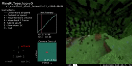

..  admonition:: Solution
    :class: toggle

=============================================================
Visualizing The Data :code:`minerl.viewer`
=============================================================

To help you get familiar with the MineRL dataset,
the :code:`minerl` python package also provides a data trajectory viewer called
:code:`minerl.viewer`:

.. warning:: BASALT: ``minerl.viewer`` can load BASALT competition data, but is not yet updated to
    display the ``use`` or ``equip`` actions yet.

The :code:`minerl.viewer` program lets you step through individual
trajectories, 
showing the observation seen by the player, the action
they took (including camera, movement, and any action described by an MineRL
environment's action space), and the reward they received.

.. exec::
 
    import minerl
    import minerl.viewer

    help_str = minerl.viewer.get_parser().format_help()

    print(".. code-block:: bash\n") 
    for line  in help_str.split("\n"):
        print("\t{}".format(line))

**Try it out on a random trajectory by running:** 

.. code-block:: bash

    # Make sure your MINERL_DATA_ROOT is set!
    export MINERL_DATA_ROOT='/your/local/path'

    # Visualizes a random trajectory of MineRLObtainDiamondDense-v0
    python3 -m minerl.viewer MineRLObtainDiamondDense-v0 

**Try it out on a specific trajectory by running:**

.. exec::
 
    import minerl
    import minerl.viewer

    traj_name = minerl.viewer._DOC_TRAJ_NAME

    print(".. code-block:: bash\n")
    
    print('\t# Make sure your MINERL_DATA_ROOT is set!')
    print("\texport MINERL_DATA_ROOT='/your/local/path'")
    print("\t# Visualizes a specific trajectory. {}...".format(traj_name[:17]))
    print("\tpython3 -m minerl.viewer MineRLTreechop-v0 \\")
    print("\t\t{}".format(traj_name))

=============================================================
Interactive Mode :code:`minerl.interactor`
=============================================================

.. warning::

    Interactor works in MineRL versions 0.3.7 and 0.4.4 (or above). 
    Install 0.3.7 with ``pip install minerl==0.3.7``, or the newest MineRL
    with ``pip install git+https://github.com/minerllabs/minerl.git@dev``.

Once you have started training agents, the next step is getting them to interact with human players.
To help achieve this, the :code:`minerl` python package provides a interactive Minecraft client called
:code:`minerl.interactor`:

.. raw:: html

    

        <iframe width="650" height="455" src="https://www.youtube.com/embed/4vM4Jz7ZXGs?controls=0" frameborder="0" allow="accelerometer; autoplay; encrypted-media; gyroscope; picture-in-picture" allowfullscreen></iframe>
    

The :code:`minerl.interactor` allows you to connect a human-controlled Minecraft client
to the Minecraft world that your agent(s) is using and interact with the agent in real time.

.. note::

    For observation-only mode hit the :code:`t` key and type :code:`/gamemode sp` to enter
    spectator mode and become invisible to your agent(s).

.. exec::

    import minerl.env._multiagent

    help_str = minerl.env._multiagent._MultiAgentEnv.make_interactive.__doc__

    # print(".. code-block:: python\n")
    help_str = help_str.replace("\n        ", "\n")
    help_str = help_str.split("Args:")[0]
    for line  in help_str.split("\n"):
        print("{}".format(line))
